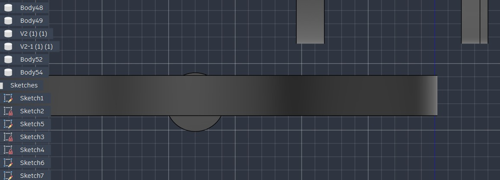
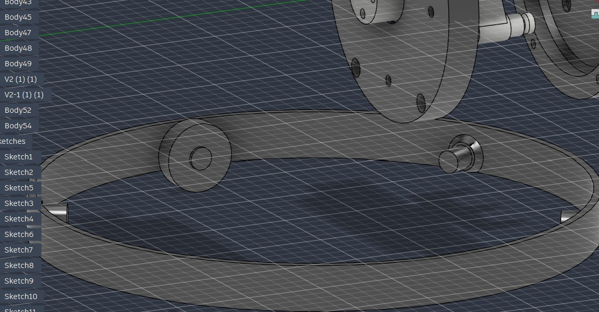
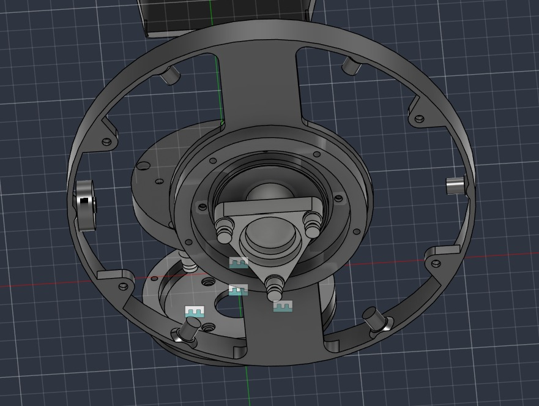

# Base Pivot

Mechanism that lets the base rotate freely (yaw joint).

## Innovation: bearings as wheels

A large-diameter ball bearing wasn't available, so an alternative solution was designed: 4 small, readily available ball bearings used as wheels to pivot the base, instead of one large bearing.

