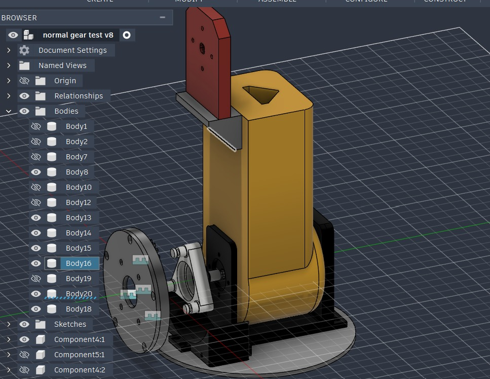
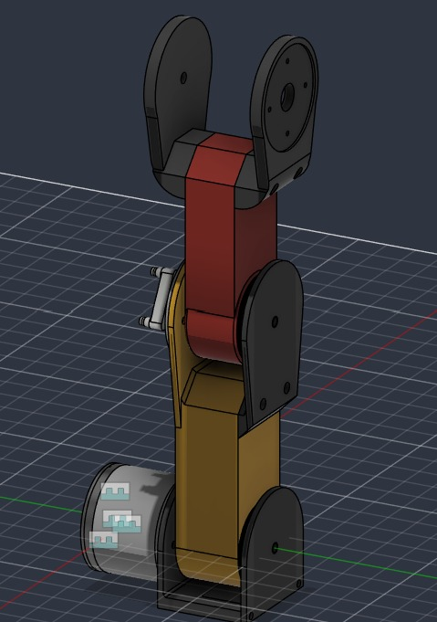
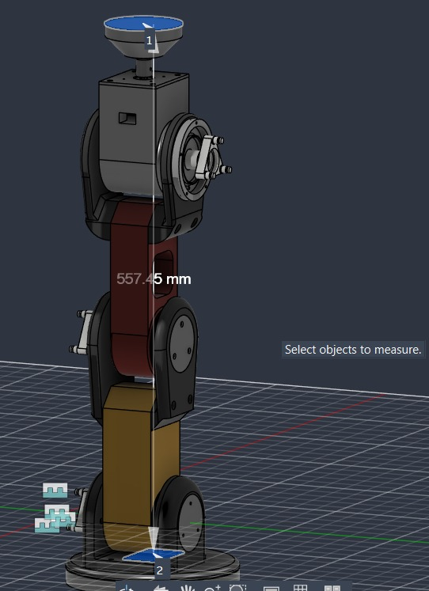

# CAD

Planning CAD version of the arm, modeled in Fusion 360.

## Progress

### 1. Started the planning CAD version

### 2. Advancing the planning CAD version

### 3. Finished the planning CAD version
Everything added and the planning CAD version completed.

