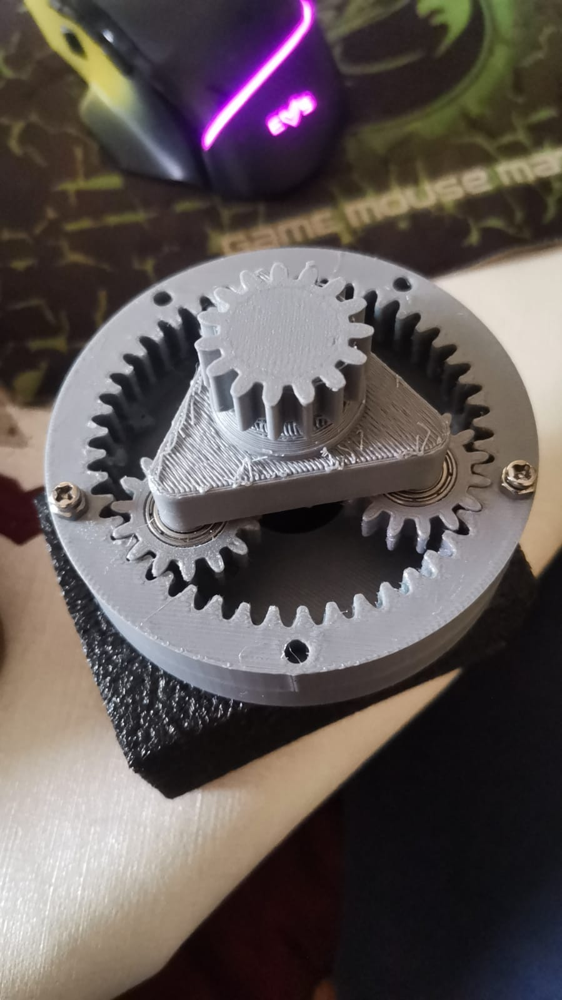
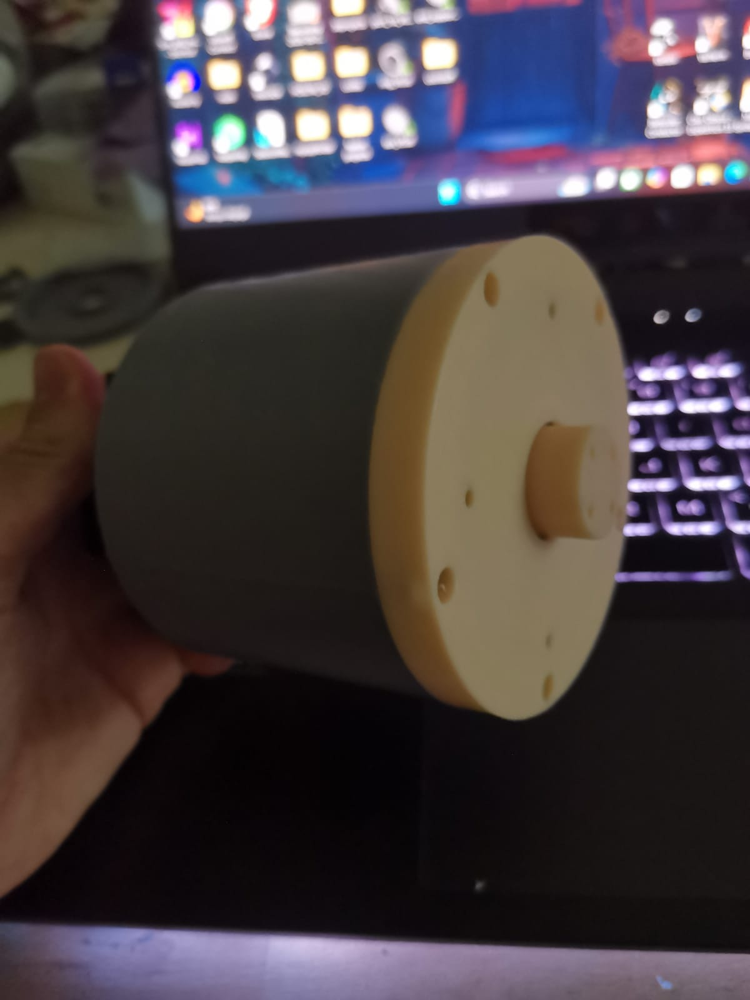

# Gearbox — Joint 1 (Base)

Final gearbox for the base joint, 1:16 ratio. Straight-cut (spur) teeth, chosen over the earlier helicoidal prototype to reduce backlash (see [`../prototype/`](../prototype/README.md) for that earlier phase).

## Progress

### 1. Ball bearings added
The gearbox is now fitted with its ball bearings and ready for duty.

### 2. Gearbox finished

