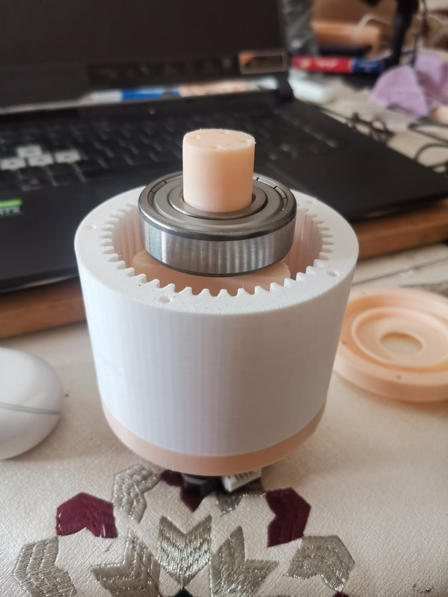
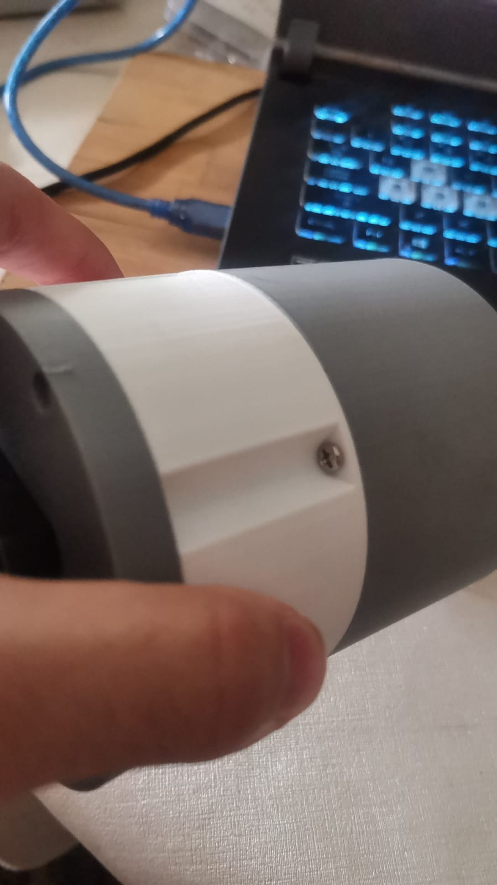
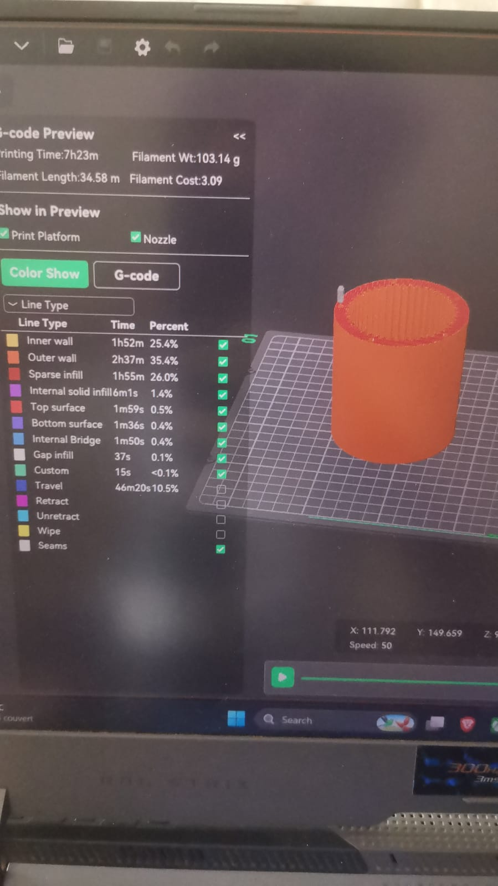
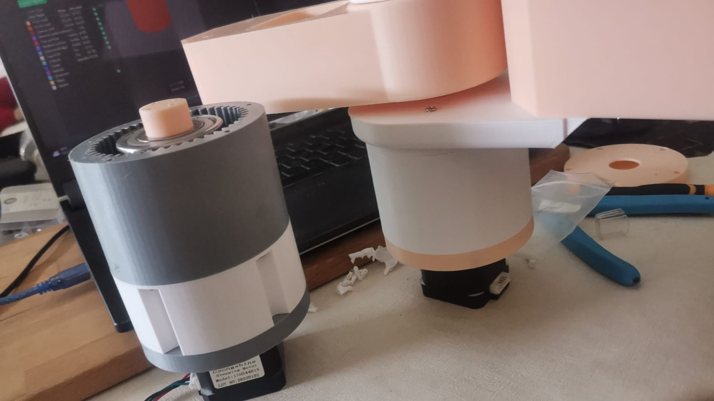
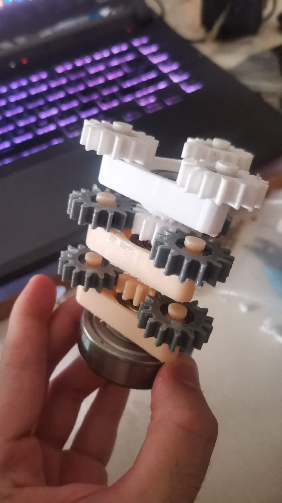
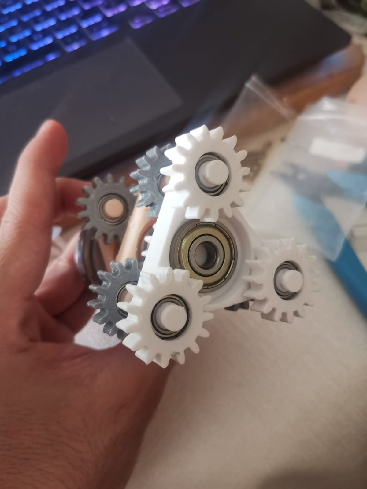

# Gearbox — Joint 2

Final gearbox for joint 2, 1:64 ratio. The initial 1:16 design (same as the base joint) wasn't enough for this joint, so a higher-reduction 1:64 gearbox was designed and its printing optimized.

## Progress

### 1. Gearbox finished

### 2. Ratio 1:64 — printing optimization
The 1:16 ratio wasn't sufficient for this joint — switched to 1:64, with printing optimized for the new design.

### 3. Size comparison: 1:64 vs 1:16
Comparing gearbox size between the two ratios, after the optimized CAD redesign.

### 4. Internal gears

