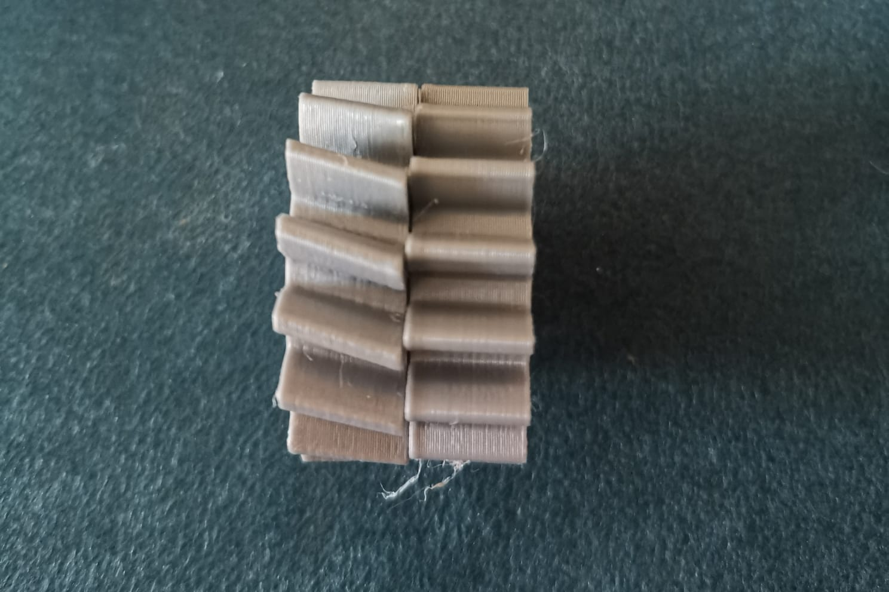
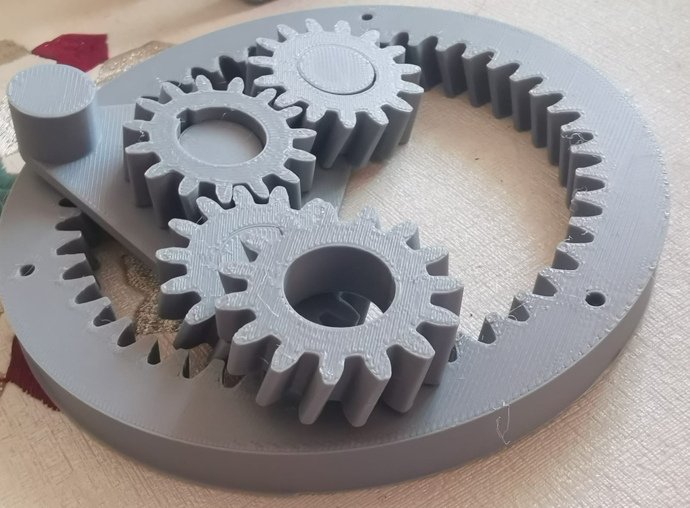
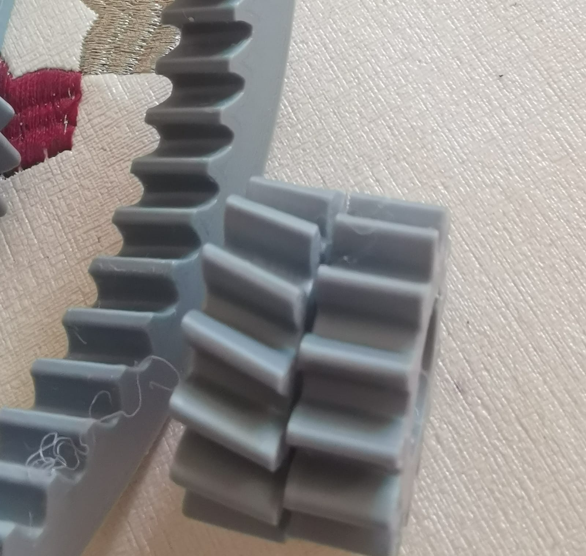
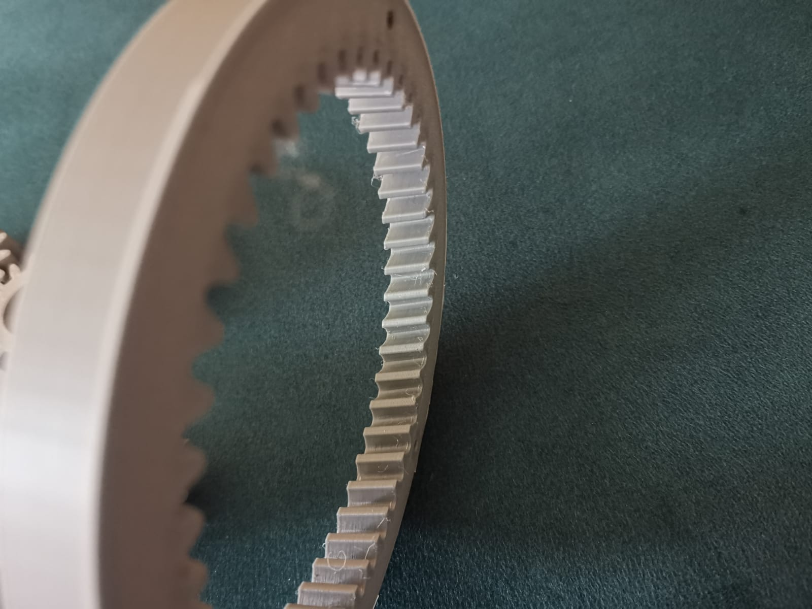
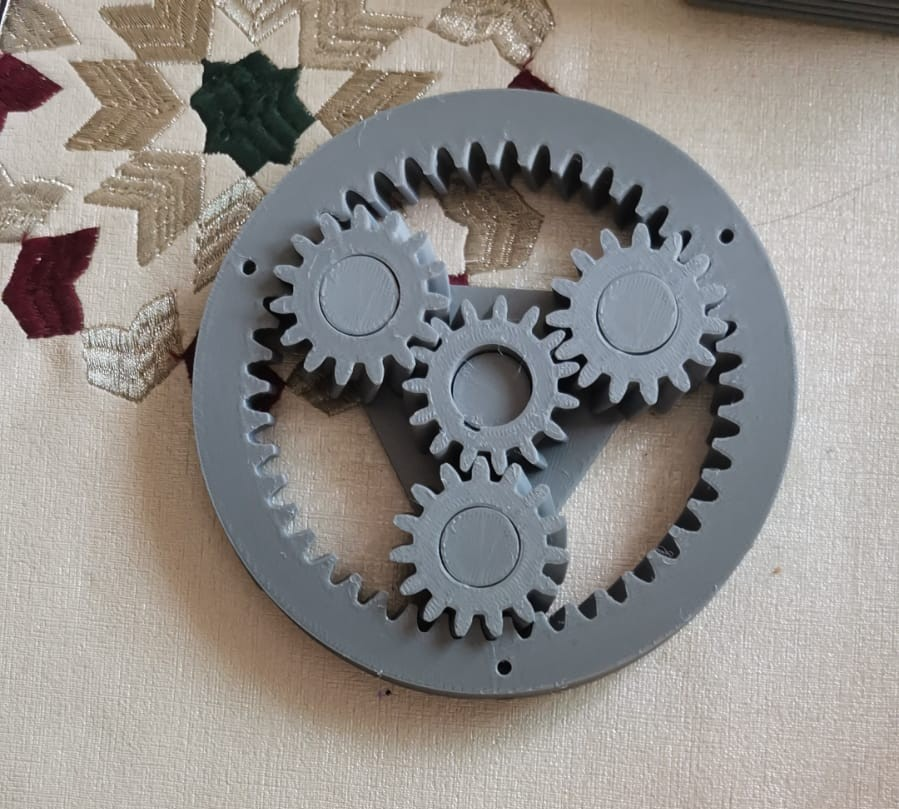
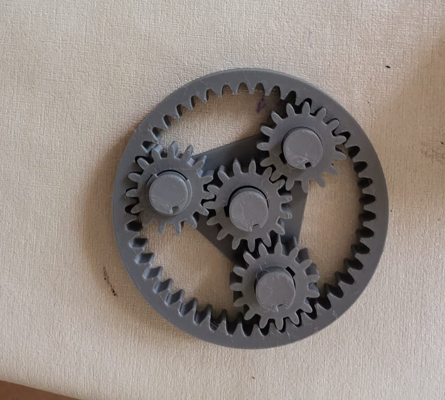
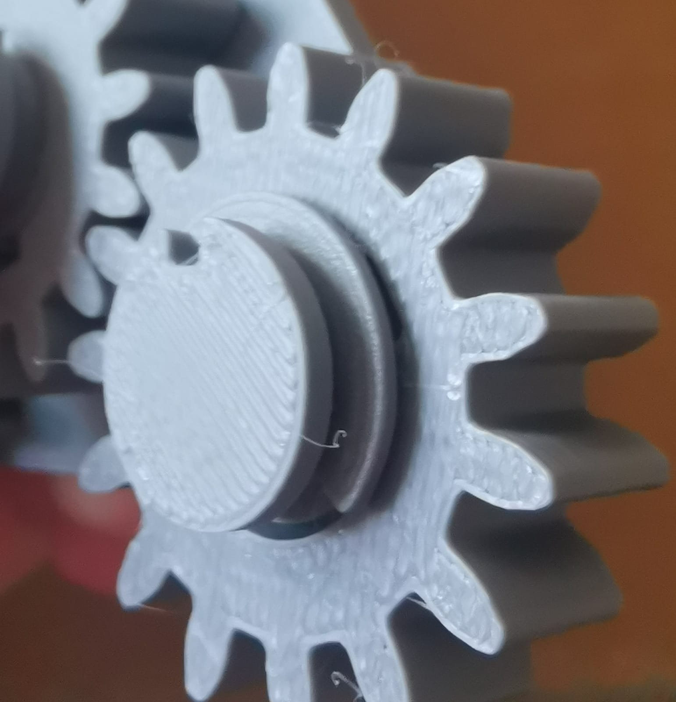

# Gearbox Prototypes

Two design iterations of the printed planetary gearbox, comparing helicoidal (helical) vs straight-cut (spur) teeth.

## Gear comparison

Side-by-side comparison of the two tooth profiles tested.

## Prototype 1 — Helicoidal teeth

Increased backlash due to print imperfections on the helix angle — the angled tooth profile is harder to print cleanly on FDM printers (overhangs along the helix), which degraded mesh quality.

## Prototype 2 — Spur teeth

Switched to straight-cut spur teeth — reduced backlash, easier to print reliably, and easier to visually inspect mesh quality.