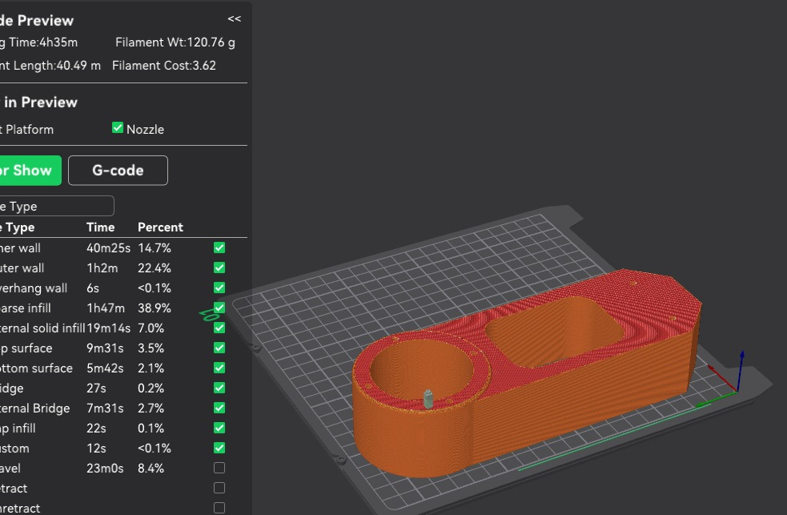
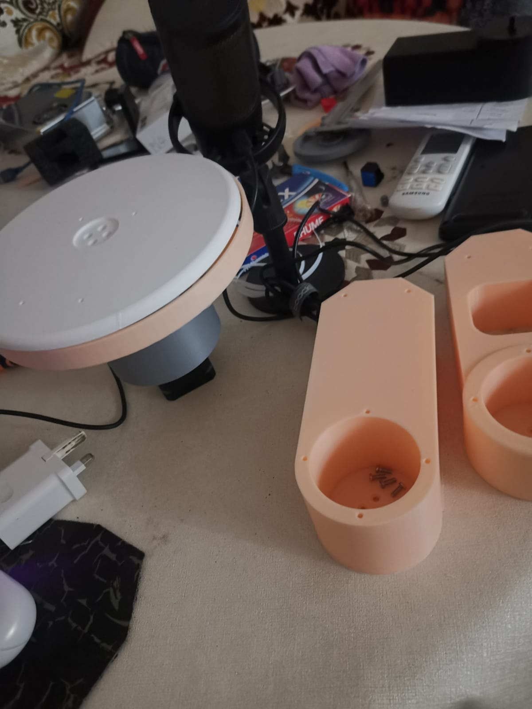
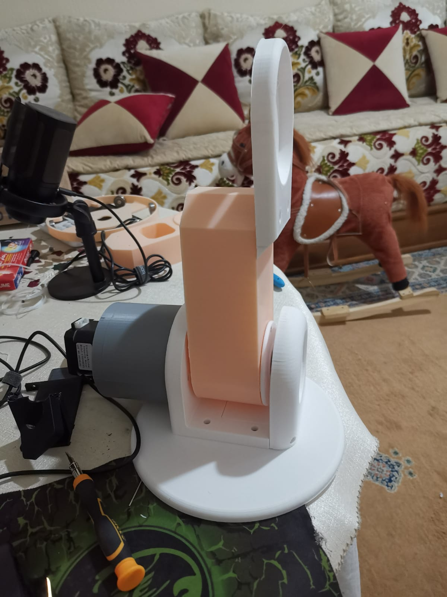
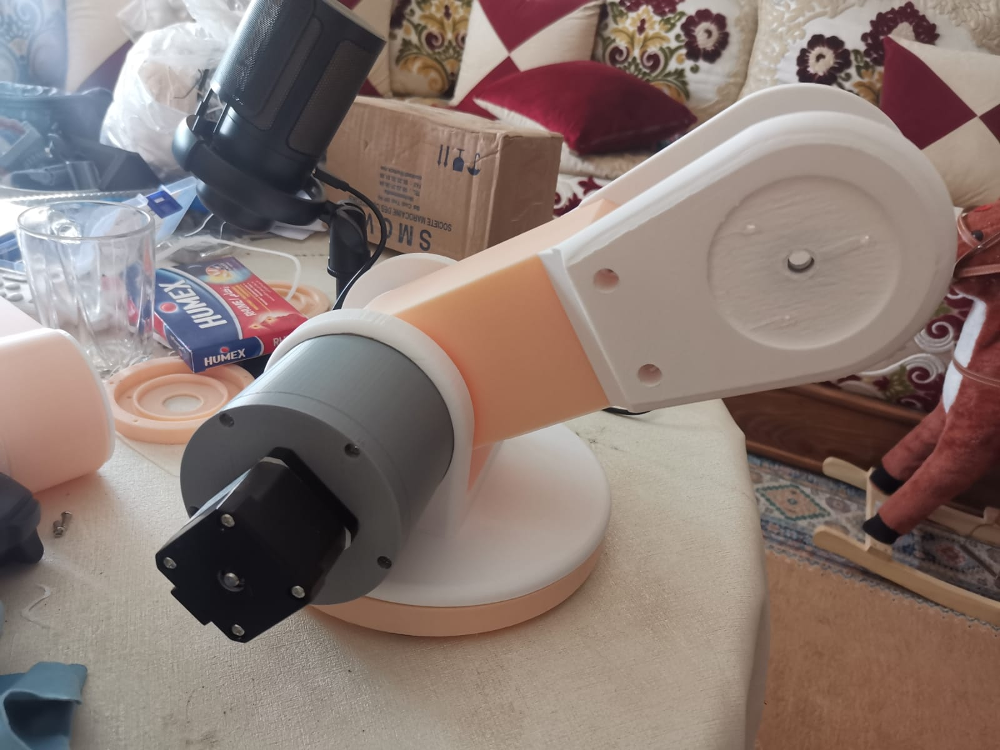

# Manufacturing

3D printing optimization and printed parts for the arm.

## Progress

### 1. Print optimization
Optimizing 3D printing settings/orientation for the parts.

### 2. Printed parts
Optimized parts printed and ready.

